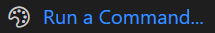

# How to avoid brittle desktop UI automation? What are the best practices?

Desktop automation imitates a human operator controlling a desktop interface. This includes opening and closing applications, simulating mouse movements and clicks, triggering keyboard keys and shortcuts, and taking screenshots.

How to automate a desktop application? What automation strategies are available? What are the strengths and the weaknesses of the different strategies? Are there best practices?

Let's go through the following options:

- Image locators
- Keyboard navigation
- OCR (optical character recognition)
- Textual locators (Windows accessibility locators)

## Image locators

The image locator strategy is based on taking screenshots of the user interface elements. The robot uses those screenshots to find the elements on the screen. The robot is instructed what to do when an element is found or not found. The action could be clicking on the element when it appears or waiting for it to disappear before continuing.

### Example

Image locators require are screenshot of an element or any section of the screen. For example, this `Run a Command...` widget on [VS Code](https://code.visualstudio.com/) welcome screen:



In addition to the screenshot, one can create a named locator for the image. The locator metadata is stored in JSON format. Using the `Run a Command...` screenshot as an example, the locator JSON might look like this:

```json
{
  "VSCode.RunCommand": {
    "confidence": 80.0,
    "path": ".images/RunCommand.png",
    "type": "image"
  }
}
```

The robot code using the locator might look like this:

```robot
*** Keywords ***
Open Command Palette
    Wait and click    alias:VSCode.RunCommand
```

### Strengths

- Image locators can target any visual elements on all major platforms (Windows, Linux, macOS).
- Image locators work without physical access to the application or the operating system (e.g., Citrix) as long as an image of the screen is available. The operating system or the application under automation does not matter.
- Image locators help determine the completion of actions based on what is or is not on the screen: a button becomes visible, a progress bar disappears.

### Weaknesses

- Image locators fail if the visuals change too much (layout, fonts, icons, colors, resolution).
- Multiple screenshots of the same elements are needed if the locator needs to work with elements that have multiple states (e.g., active vs. inactive) since a different color or background color often conveys the element state.
- The application state (and thus the GUI) might differ on application start requiring some robot logic for resetting a known start state.

## Keyboard navigation

Opening windows and dialogs, executing tasks, and navigating can be done without a mouse if the application has good keyboard support (having access to all the core functionality with just the keyboard).

### Example

This robot keyword uses a shortcut key combination (`Ctrl+Shift+P`) to open the VS Code Command Palette:

```robot
*** Keywords ***
Open Command Palette
    Press Keys    ctrl    shift    p
```

### Strengths

- Keyboard shortcuts change less often than visual user interfaces, making them more robust than image locators. Even if the screen resolution, colors, or fonts change, keyboard shortcuts usually stay the same.
- Keyboard shortcuts are easy to test manually, making development faster compared to creating image-based locators.

### Weaknesses

- All applications do not have sufficient keyboard support.
- Keyboard shortcuts are excellent for triggering actions, but there are no shortcuts for determining when it is safe to proceed after triggering an action that takes some time to complete.
- Keyboard navigation needs to be used together with either image or OCR locators to assert the completion of slow operations.

## OCR

OCR locators work by extracting and matching text on the screen. The locator can be written in plain text (e.g., "Submit"). The robot will find the text on the screen programmatically.

### Example

This keyword uses OCR (to read text from the screen) to determine when a slow action has completed. After executing the robot creation command on the VS Code UI, the robot waits for the environment update notification (`Update env`) to appear and then disappear to indicate the completion of the action:

```robot
Create robot
    Type and run    robocorp-create-robot
    Wait for text    Update env
    Wait for text to disappear    Update env
```

### Strengths

- An OCR locator is plain text and thus easy to implement.
- OCR locators can be somewhat more resilient against some visual UI changes than image locators (resolution, layout, color).

### Weaknesses

- OCR locators can fail due to a lack of contrast or UI effects such as shadows and transparency.
- OCR locators require unique matches. If there are no unique texts on the screen, one needs to target specific parts of the screen to narrow down the results, making the locator less resilient against visual changes.

## Textual locators (Windows accessibility locators)

Some Windows applications can be automated by targeting the actual UI elements within them, referring to them by their [textual UI accessibility identifiers](https://robocorp.com/docs/development-guide/desktop/how-to-find-user-interface-elements-using-locators-and-keyboard-shortcuts-in-windows-applications#inspecting-windows-applications-with-accessibility-insights).

### Strengths

- Accessibility locators are robust and resilient to visual changes. The identifiers stay the same across operating system versions.
- Accessibility locators support waiting for the locators, making it possible to monitor the application's state to proceed when it's safe to do so.

### Weaknesses

- Not all Windows applications can be inspected for accessibility locators.
- If the application is accessed remotely using Citrix or a similar protocol, the accessibility identifiers are unavailable.

## Which strategy to choose?

In practice, a combination of all the strategies is the best compromise. Use the strengths, be mindful of the weaknesses, and combine all the strategies to build a robot that does what it's supposed to do and is quite resilient against moderate changes in the UI.

The recommended order from the most robust to the least robust:

- Textual accessibility locators
- Keyboard navigation
- Image locators and OCR locators
